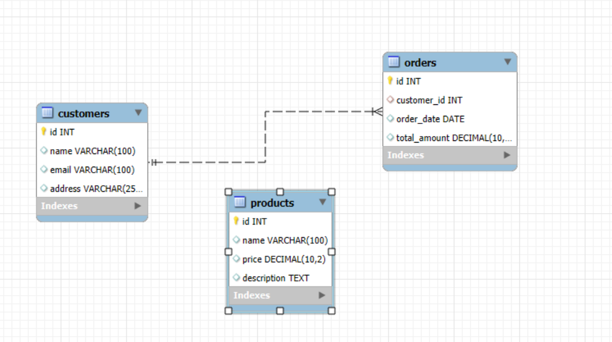
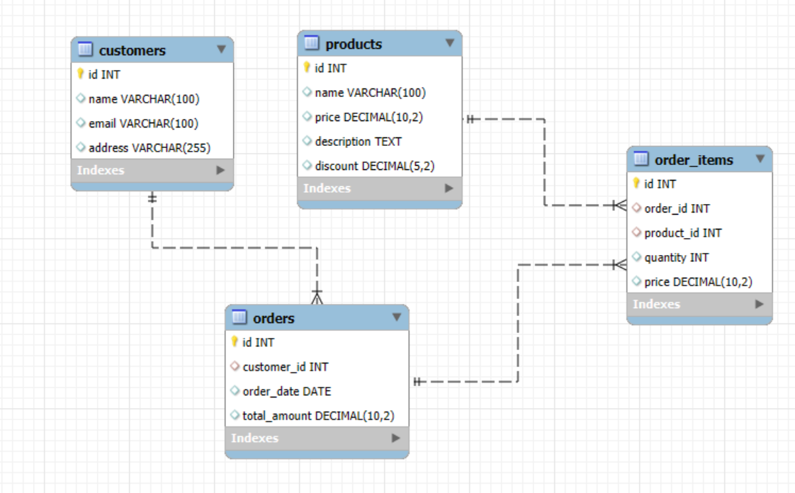

#Task:

Create a database and tables to manage a simple e-commerce system. 
The system should have three tables: customers, orders, and products.

#Requirements:

Create a database named ecommerce.
Create three tables: customers, orders, and products.
Insert some sample data into the tables.

#Initial DB Diagram

#Updated DB Diagram
